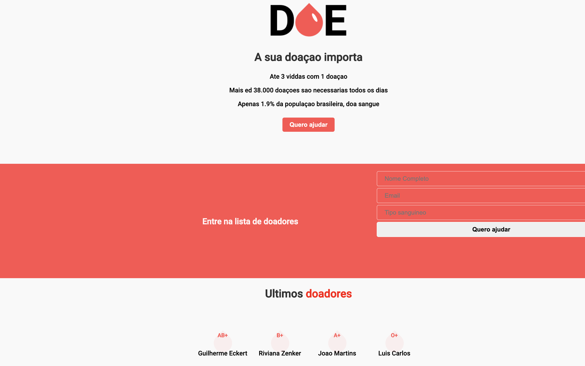

<blockquote align="center">“Keep it Simple, Stupid”!</blockquote>

<h1 align="center"> DOE </h1>

  

I started this application for developing my skills in html, css, javaScipt.

**Template**

  

### Backend

dependencies
  - Cors
  - Dotenv
  - Express
  - pg

### Frontend

Dependencies

  - React
  - Typescript

<h1 align="center" border-radius= "50%">
  
</h1>

Made with by Guilherme S.Eckert [Get in touch!](https://www.linkedin.com/in/guilherme-eckert/)
